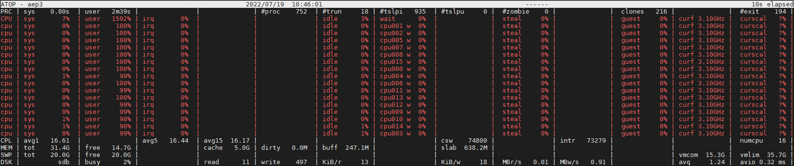

# 記一次 MariaDB CPU Loading 滿載查修過程

## 起因

客戶環境的 MariaDB 把 CPU Resource 都吃滿了，

用 `SHOW PROCESSLIST` 查詢有看到好幾條慢的查詢，亂槍打鳥調整了前幾筆都不見改善。

為了要可以比較精準地改善問題，做了一些研 (goo) 究 (gle)。

## 症狀

1. 用 TOP 只看得到 CPU 吃滿，但是記憶體的狀況是 OK 的

    
2. ATOP 看起來硬碟也不忙，由於服務跟 DB 建在同一台，應該也不是網路問題

    
3. 約好停服務之後，不管三七二十一先 `OPTIMIZE TABLE` 也沒有用
4. 卡住的前幾名都是 UPDATE，一度懷疑是寫入的問題，但是實際找一個測試資料 Insert / Update 都很快，把這個 UPDATE 相關的 Code 拔掉也沒有用。

## 修復流程

### 值得參考的流程

[A Simple Approach to Troubleshooting High CPU in MySQL - Percona Database Performance Blog](https://www.percona.com/blog/2020/04/23/a-simple-approach-to-troubleshooting-high-cpu-in-mysql/)

參考了 Percona 給出的流程，寫得挺不錯的 👍

雖然我的 DB 版本太舊了沒有用 (必須要 MariaDB 10.5 以上才有 `THREAD_OS_ID` )。

不過還是講一下，思路是：

1. 單從 pid 只會看到 process 很忙，看不出是哪個 command 很忙，因為是 multi-thread。
2. 想辦法找到 thread id ，看看是哪個 thread 在忙。
3. 有 thread id 之後就可以用， `performance_schema.threads` 找到 `THREAD_OS_ID` 對應的 Command。

### 我的流程

因為我的 MariaDB 還沒有升級到 10.5，所以我是去看 process list 中比較慢的 query。

對這些 Query 查看 query plan，最後找到一筆 `SELECT` ，在把服務切斷的狀態下就要四秒。

    describe SELECT * FROM problem_table WHERE id=100 AND `path` LIKE '某個關鍵字%';
    +------+-------------+---------------+------+-------------------------------------------------------+-----------------+---------+-------+---------+-------------+
    | id   | select_type | table         | type | possible_keys                                         | key             | key_len | ref   | rows    | Extra       |
    +------+-------------+---------------+------+-------------------------------------------------------+-----------------+---------+-------+---------+-------------+
    |    1 | SIMPLE      | problem_table | ref  | index_1,index_2,index_3                               | index_3         | 4       | const | 4213770 | Using where |
    +------+-------------+---------------+------+-------------------------------------------------------+-----------------+---------+-------+---------+-------------+

看到 `index_3` (被我碼掉了) 是 `fid`+ `extra` 的聯合索引，對 `path` 沒有幫助

覺得應該是沒有適合的 Index，才會這麼久。

針對 `fid` + `path` 去建 Index，最後就解決問題了：

    create index index_4 on problem_table(field_1,field_2(768));
    Query OK, 0 rows affected (1 min 29.487 sec)
    
    describe SELECT * FROM problem_table WHERE fid=100 AND `path` LIKE '某個關鍵字%';
    +------+-------------+---------------+-------+-------------------------------------------------------+-----------------+---------+-------+---------+------------------------------------+
    | id   | select_type | table         | type  | possible_keys                                         | key             | key_len | ref   | rows    | Extra                              |
    +------+-------------+---------------+-------+-------------------------------------------------------+-----------------+---------+-------+---------+------------------------------------+
    |    1 | SIMPLE      | problem_table | range | index_1,index_2,index_3,index_4                       | index_4         | 2311    | NULL  | 1       | Using index condition; Using where |
    +------+-------------+---------------+-------+-------------------------------------------------------+-----------------+---------+-------+---------+------------------------------------+
    
     
    MariaDB [owncloud]> ELECT * FROM problem_table WHERE fid=100 AND `path` LIKE '某個關鍵字%';
    Empty set (0.000 sec)

SLA 未達承諾是要被罰的，當時這個方法有用就先頂著用了。

## 事後諸葛

在現場時憑著一股直覺，覺得用到 `fid` + `path` 就去建構這兩個的聯合索引，

那到底這樣建 index 為什麼有用，要來事後諸葛一下：

1.  `fid` 是外來鍵， `fid` 為 100 的這個 case，在 DB 中有 400 多萬筆，佔全部的一半 → 基數很小 → 單獨拿來建索引可能沒啥用
2. `path` 是拿來搜索路徑的，通常都是找該路徑之下的全部 → 用了 `LIKE`，但是 `%` 在右邊 → Prefix match 是可以用到索引的
3. `path` 的基數很大 → 建 index 效果不錯
4. `key_len` 顯示不是只有用到聯合索引中的第一個 (`fid`)
5. `rows` 是 `1` 表示只需要掃一行就可以了 (越小越好)
6. `Extra` 有 `Using index` 表示在索引樹中就可以找到資訊，表示還不錯

有機會可以再做幾個嘗試：

1. 只建 `path` 可不可以 → 基數算大，所以想嘗試
2. 反過來建成 `path` + `fid` 會不會更好 → 基數大的放前面，想試試看

## 參考資料

[MySQL 执行计划 explain plan](https://www.jianshu.com/p/57a42f6a8746)

[30-13 之資料庫層的優化 - 索引設計與雷區](https://ithelp.ithome.com.tw/articles/10221971)

[A Simple Approach to Troubleshooting High CPU in MySQL - Percona Database Performance Blog](https://www.percona.com/blog/2020/04/23/a-simple-approach-to-troubleshooting-high-cpu-in-mysql/)

[MySQL 性能优化神器 Explain 使用分析](https://segmentfault.com/a/1190000008131735)

[第25期：索引设计（索引的基数与可选择性） - 爱可生开源社区](https://opensource.actionsky.com/20210407-mysql/)