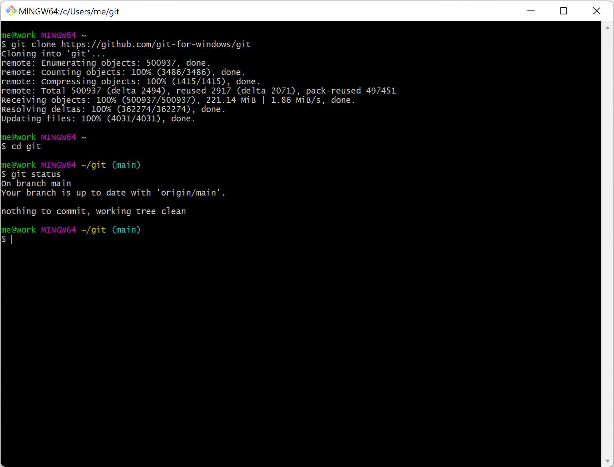
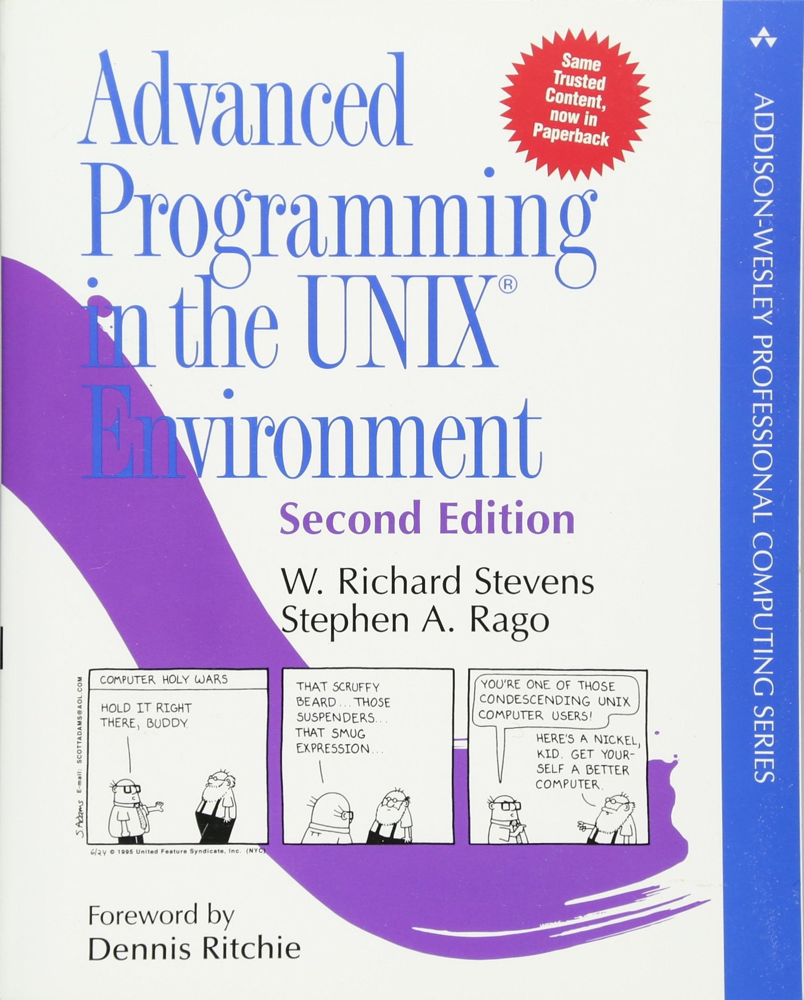
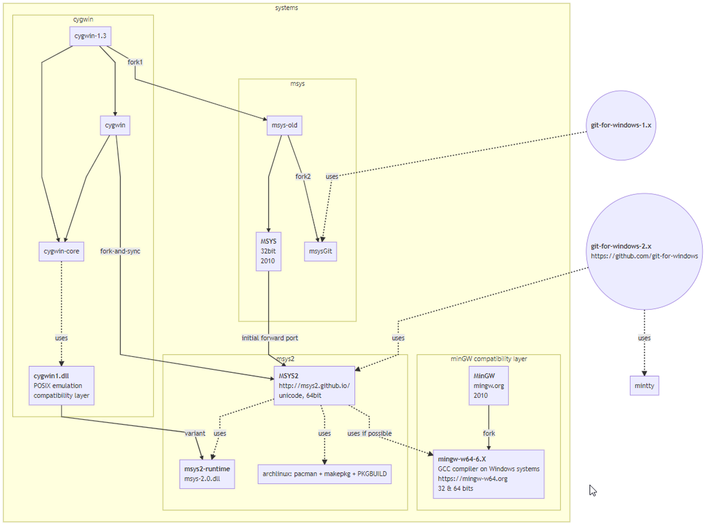

# Windows 上的類 Unix 環境 - Cygwin、MinGW、MSYS

---

## 起因

裝了 CLion，想在 Windows 底下為了在 Windows 上使用 `gcc` ，沒有想到竟然如此困難。

JetBrains IDE 會自動偵測有沒有 Git ，在 Windows 上如果沒有先裝好的話，他就會安裝 Git for Windows。

Git for Windows 自帶了一個很像 Linux 的環境，但是卻很難用它開始進行 C 的開發。

## 古早味做法

[Dev-C++ - 维基百科，自由的百科全书](https://zh.wikipedia.org/zh-tw/Dev-C%2B%2B)

[Code::Blocks](https://www.codeblocks.org/)

Code::Blocks 跟 Dev-C++ 是 Windows 上的 C/C++ IDE，

剛入門的時候都是用這兩套，裝好就會順便幫你裝 `MinGW`。

反正會動，可以交作業就好，所以當時也沒有很在意到底不同的方案差在哪裡，只知道可能有些東西會編不過。

[Best way to get around fork() with MingW 64?](https://stackoverflow.com/questions/33675953/best-way-to-get-around-fork-with-mingw-64)

從 Wiki 上我們可以大概知道這是什麼東西：

> **MinGW**（**Min**imalist **G**NU for **W**indows），又稱**mingw32**，是將 [GCC](https://zh.wikipedia.org/wiki/GCC) 編譯器和 [GNU Binutils](https://zh.wikipedia.org/zh-tw/GNU_Binutils) 移植到Win32平台下的產物，包括一系列標頭檔（[Win32API](https://zh.wikipedia.org/wiki/Windows_API)）、[函式庫](https://zh.wikipedia.org/wiki/%E9%9D%9C%E6%85%8B%E9%80%A3%E7%B5%90%E5%87%BD%E5%BC%8F%E5%BA%AB)和[可執行檔](https://zh.wikipedia.org/wiki/%E5%8F%AF%E6%89%A7%E8%A1%8C%E6%96%87%E4%BB%B6)。

> 2005年, OneVision Software遵照[淨室設計](https://zh.wikipedia.org/wiki/%E5%87%80%E5%AE%A4%E8%AE%BE%E8%AE%A1)原則，開始開發Mingw-w64，因為最初的MinGW項目更新太慢，遲遲不支持64位環境開發

其他科系的程式設計課用的都是 Visual Studio，用的編譯器是 Visual C++，我沒用過不清楚，

不過概念應該是相同的，有些東西 Windows API 不支援就不能用，例如 `fork()` 。

## 裝 git on windows 跑出來的 MinGW

現在裝完 git for windows 2.x 之後，就會有一個 git bash 可以用，上面寫著 `MINGW64`

這就是一開始提到的，裝 code::block 或 dev-c++ 可以順便裝的編譯環境。

既然裝 git 就有，就想要拿來試著開發看看。

但進到 bash 裡面卻發現沒有 make 可以用，於是就想要模仿 Linux 在上面用套件管理器裝一些套件。

但是在找資料的過程中發現，很多人都說，git for windows 是搭建在 MSYS / MSYS2 上面，那 MSYS 又是什麼？

## MSYS2

[MSYS2 - MSYS2-Introduction](https://www.msys2.org/wiki/MSYS2-introduction/)

[MSYS2 - How does MSYS2 differ from Cygwin?](https://www.msys2.org/wiki/How-does-MSYS2-differ-from-Cygwin/)

> MSYS2 is software distribution and a building platform for Windows. 
> It provides a Unix-like environment, a command-line interface and a software repository making it easier to install, use, build and port software on Windows. 
> That means Bash, Autotools, Make, Git, GCC, GDB..., all easily installable through Pacman, a fully-featured package manager.
> It is an independent rewrite of MSys, based on modern Cygwin (POSIX compatibility layer) and MinGW-w64 with the aim of better interoperability with native Windows software.

> MSYS2 consists of three subsystems and their corresponding package repositories, `msys2`, `mingw32`, and `mingw64`.

> The `mingw` subsystems provide native Windows programs and are the main focus of the project.
> These programs are built to co-operate well with other Windows programs, independently of the other subsystems.
> This part builds on the MinGW-w64 project.

> The `msys2` subsystem provides an emulated mostly-POSIX-compliant environment for building software, package management, and shell scripting.
> These programs live in a virtual single-root filesystem (the root is the MSYS2 installation directory). 
> Some effort is made to have the programs work well with native Windows programs, but it's not seamless. This part builds on the Cygwin project.

這邊寫 MSYS2 有兩大類的子系統：

- MinGW - 移植的 GCC 編譯器與工具鏈，屬於 Windows 原生。
- MSYS2 - 基於 Cygwin 改寫，屬於模擬 POSIX

MSYS2 可以用 `pacman` 作為套件管理工具，但是 Git for Windows 上沒有。如果裝 Git for Windows SDK  的話就會有，但是很肥。

有嘗試著下載安裝包直接裝在系統上，不過卡了一個 zstd 很麻煩，但那就是另外一個故事了。

最後我自己裝了 MSYS2 ，跟 Git 分開來，就可以順利的編譯了。

不過好像還有另外一個選擇，以前在學校有看老師用過，就是剛剛提到的 Cygwin。

## 更像 Unix 的環境 - Cygwin

### What is it?

摘自官網

> Cygwin is:
> * a large collection of GNU and Open Source tools which provide functionality similar to a [Linux distribution](https://en.wikipedia.org/wiki/Linux_distribution) on Windows.
> * a DLL (cygwin1.dll) which provides substantial POSIX API functionality.
- 一個 GNU 和開源工具的大集合，在 Windows 上提供類似 Linux 發行版的功能
- `cygwin1.dll` 提供大量 POSIX API 的功能

> Cygwin is not:
> * a way to run native Linux apps on Windows. You must rebuild your application *from source* if you want it to run on Windows.
> * a way to magically make native Windows apps aware of UNIX® functionality like signals, ptys, etc. Again, you need to build your apps *from source* if you want to take advantage of Cygwin functionality.
- 不是在 Windows 上跑 Linux 原生程式的方法。要可以跑，要從原始碼重新 Build。
- 一種讓 Windows 程式可以神奇地使用 Unix 功能的方法，但是要從原始碼重新 Build。

重點就是 `cygwin1.dll` ，模擬了很多 Unix 功能，其實 Build 出來的是連結了這個 dll 的 windows 程式。

與 MinGW 與 Cygwin 的異同，在 wiki 上可以找得到，摘自 Wiki：

> Cygwin 與 MinGW 皆可用來移植 Unix 軟體到 Windows，但它們採用截然不同的實作。

> Cygwin 旨在提供一個完整的 [POSIX](https://zh.wikipedia.org/wiki/POSIX) 層，包括主流 Unix 的系統呼叫及函式庫實作；其重視相容性優先於效能。

> 相對的，MinGW 則著重簡化與效能。因此，它並不提供某些難以用 Windows API 實作的 POSIX API，例如 `fork()`，`mmap()` 和 `ioctl()`。

據說有一些效能問題，而且也不確定是不是 100% 模擬。但是拿來通過大一的程式設計課是綽綽有餘的。

到之後的高等程式設計，大家就直接在 Unix 環境底下作業了。

## 關係圖

Stack Overflow 上大神整理好的關係圖，我覺得很清楚

出處：[https://stackoverflow.com/questions/25019057/how-are-msys-msys2-and-msysgit-related-to-each-other](https://stackoverflow.com/questions/25019057/how-are-msys-msys2-and-msysgit-related-to-each-other)

## 也許是更好的方案：WSL2

[某些场景下 wsl2 的文件系统简直蛋疼的不行 - V2EX](https://www.v2ex.com/t/793055)

[使用 WSL 執行 Linux GUI 應用程式](https://docs.microsoft.com/zh-tw/windows/wsl/tutorials/gui-apps)

既然在 Windows 上開發 Unix 程式，環境這麼不好搞定，那就乾脆 toolchain 放在 VM 之類的環境裡面。

搜尋了一下有滿多人在抱怨如果要把編譯環境放在 WSL 裡面，但是用 Windows 上的編輯器 / IDE 開發很不順手 (路徑轉換、效能問題 …)。

> 不在 wsl2 里安装 ide 的话，lz 的问题永远解决不了
> 本身跨虚拟机宿主机之间的文件交互性能就很差，你一定要在 Windows 下读 WSL2 的文件或 WSL2 读 Windows 都不会有好体验的

> lz 你不想在 wsl2 里装 ide 结果就是反倒这是最麻烦的解决办法。而且在 wsl2 里装 IDE 的话，你将能解锁一键完整迁移电脑上的快发环境到别的电脑的隐藏优点。

所幸 JetBrains IDE 是可以裝在 Linux 上的，可以利用 WSL 跑 Linux GUI，或者是跑 JetBrains Gateway 應該都會動。

正確的姿勢應該是連 IDE 都裝在 WSL 裡面，就可以解決很多 Windows 跟 WSL 溝通得困難。

如果 Server 不夠強，或是怕桌機太閒了可以試試看這個方法，應該可以解決掉很多問題 (例如：不能用 rsync ，權限不一樣，換行符號不一樣 …)

## 番外：在 Git Bash 上裝額外的東西是很麻煩的

以 `rsync` 為例，想要在 Git Bash 上使用 `rsync` ，可以直接把 binary 跟 dll 丟進去就好了

[Package: rsync - MSYS2 Packages](https://packages.msys2.org/package/rsync?repo=msys&variant=x86_64)

但是他的副檔名是 `.tar.zst`，這是 facebook 開發的一種壓縮格式，目前 windows 官方的解壓縮跟官方版本的 7z 都還不支援。

我們可以去 github 下載 windows 版的 `zstd.exe` 就可以在 zstd 的目錄中，從 cmd 解開得到 tar 檔：

    .\zstd.exe -d rsync-3.2.3-2-x86_64.pkg.tar.zst

[Releases · facebook/zstd](https://github.com/facebook/zstd/releases)

把解出來的內容丟到 git 的目錄下，例如我的是： `C:\Program Files\Git`

但是這樣還是跑不起來，原因就是它還有缺相依的 dll，所以下載兩個相依的 dll 如法炮製：

- libzstd

    [Package: libzstd - MSYS2 Packages](https://packages.msys2.org/package/libzstd?repo=msys&variant=x86_64)
- libxxhash

    [Package: libxxhash - MSYS2 Packages](https://packages.msys2.org/package/libxxhash?repo=msys&variant=x86_64)

## 參考資料

[How are msys, msys2, and msysgit related to each other?](https://stackoverflow.com/questions/25019057/how-are-msys-msys2-and-msysgit-related-to-each-other)

[Cygwin vs MinGW vs MSYS2](https://zhuanlan.zhihu.com/p/360773277)

[How/why cygwin breaks windows permissions?](https://stackoverflow.com/questions/43146372/how-why-cygwin-breaks-windows-permissions)

[POSIX、Cygwin、MSYS、MSYS2、MinGW、MinGW-w64的区别_deparks的博客-CSDN博客_msys msys2](https://blog.csdn.net/u012408797/article/details/120490201)

[Cygwin 与 MinGW/MSYS/MSYS2，如何选择？](https://blog.zengrong.net/post/cygwin_and_mingw/)

[MSYS2 - How does MSYS2 differ from Cygwin?](https://www.msys2.org/wiki/How-does-MSYS2-differ-from-Cygwin/)